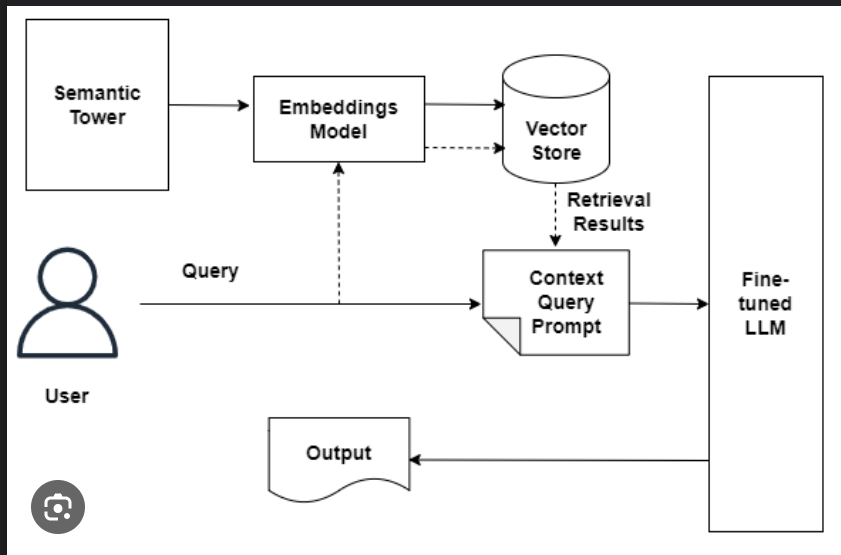

# TestAutomation_RAG-LLM
# Introduction to AI and LLM - How they work

**AI**: creating systems capable of performing tasks requiring human intelligence such as, understanding languages,
    recognising patterns, decision-making, problem solving, etc.

**LLM**: Advanced AI models, trained on vast amounts of text data to understand, generate, and interact with
     natural languages using deep learning techniques, specially transformers.

### How LLM works:
1. **Pre-Training** : _Trained_ on diverse datasets (books, articles, code, etc. ) to predict the next word in a sentence
2. **Fine-Tuning** : _Refined_ for specific tasks like customer support or medical diagnosis
3. **Inference** : _Generate_ responses to user queries using pre-trained knowledge

### Top 5 LLM:
1. **GPT-4** : versatile, multi-tasking, reasoning and conversations.
2. **Gemini** (Google) : advanced reasoning and multi-modal capabilities.
3. **Claude** (Anthropic) : Safety focused conversational model optimized for ethical AI.
4. **GitHub Copilot** (OpenAI Codex) : Assistance for coding
5. **Perplexity AI** : Combines retrieval-augmented generation with conversational AI for fact based responses.

### LLM Challenges :
1. **Outdated Knowledge** : Pre-Trained LLMs may lack recent or domain specific info (e.g., company policy, FAQs)
2. **Data Privacy** : LLMs cannot inherently verify or access private/secure documents.
3. **Hallucination** : LLMs can generate fabricated or inaccurate information.

### RAG Architecture :

